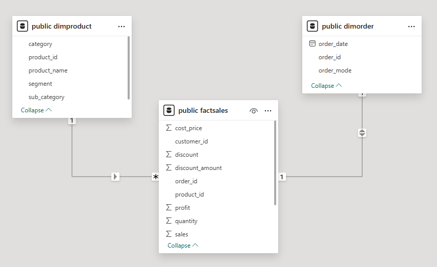
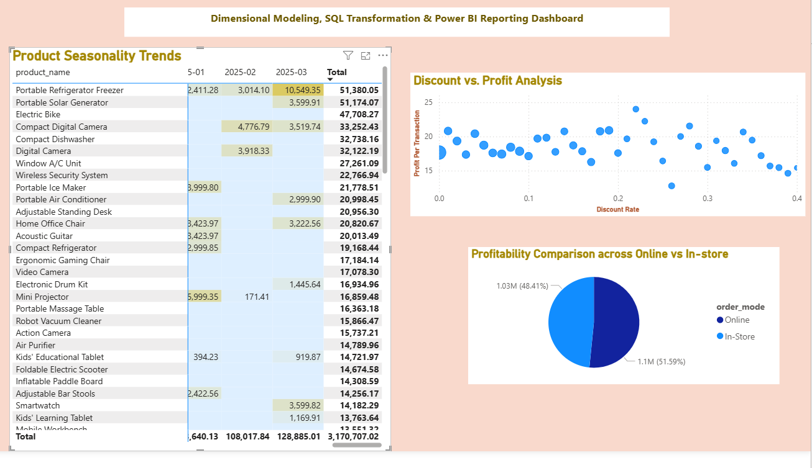

# RDAMP-Dimensional-Model-PowerBI

## Project Title: SQL-Based Data Modeling and Dashboarding with Power BI

**Reported by:** Christine Ugochi, Retail Sales Director, Ace Superstore  
**Submitted by:** Kousar Saleem  

---

## Introduction

This project is part of the RDAMP program’s second task, focused on transforming a cleaned retail dataset into a business-ready reporting system. The aim was to implement a dimensional model using SQL, generate insightful queries and views, and connect these to Power BI for dynamic dashboard development. 

By integrating data from product and order dimensions with a central fact table, we have enabled detailed analysis of Ace Superstore’s sales operations. The dashboard provides an intuitive way to examine seasonal trends, discount impacts, sales performance across channels, and customer profitability.

---

## Schema Design

A star schema was implemented to support scalable reporting and data slicing. It consists of a central fact table (`FactSales`) surrounded by descriptive dimension tables. Each dimension describes a different business aspect (e.g., product, order mode), while the fact table stores transaction-level sales data.

The star schema allows for efficient querying and direct integration with BI tools for analytics.

### Schema Structure

The figure below illustrates the relationships between the fact and dimension tables used:

---

## Table Descriptions

### FactSales

The `FactSales` table is the core of the schema, holding all measurable sales values. It includes attributes like `Sales`, `Cost_Price`, `Profit`, `Quantity`, and `Discount`, along with foreign keys linking to `DimOrder` and `DimProduct`. This table supports all calculations related to profitability, revenue, and order metrics.

### DimProduct

This dimension provides descriptive details about products, including product name, category, sub-category, and segment. It allows slicing the fact data to evaluate performance across different product types and hierarchies.

### DimOrder

This dimension captures order-specific metadata, such as the date of purchase and whether the sale occurred online or in-store. It is especially useful for time-based analysis and sales channel comparisons.

---

## SQL Implementation Guide

The project is powered by a PostgreSQL backend, where all schema creation, data loading, and query logic was executed. Below are the major steps taken:

1. **Table Creation**  
   All tables were defined using `CREATE TABLE` statements, including proper data types and foreign key constraints to ensure referential integrity.

2. **Data Loading**  
   Data for each table was imported from CSV files using the `COPY` command. This ensured clean and fast ingestion of the cleaned dataset from Task 1.

3. **View Creation**  
   Several SQL views were created to generate reusable summaries for Power BI:
   - `vw_product_seasonality`: Tracks product revenue by month.
   - `vw_discount_impact_analysis`: Shows how discount rates affect profit per transaction.
   - `vw_channel_margin_report`: Compares profitability across online and in-store channels.

4. **Analytical Queries**  
   In addition to the views, five strategic SQL queries were written to analyze top-selling products, customer contributions, category trends, and average order values. These are stored in the project SQL file for reuse.

---

## Connecting PostgreSQL to Power BI

To visualize the data:

1. Open Power BI Desktop.
2. Select **Get Data → PostgreSQL Database**.
3. Input your server details and database name.
4. Load the data, then use Power BI’s interface to design interactive visuals.

Once connected, all data updates in Power BI can be refreshed dynamically based on the underlying SQL views.

---

## Power BI Dashboard

The Power BI dashboard provides several important views to support decision-making:

### Visual Highlights

- **Product Seasonality Trend:**  
  A matrix chart displays revenue patterns across time for different products, revealing strong seasonality for items like Electric Bikes and Portable Solar Generators.

- **Discount vs. Profit Scatter Plot:**  
  This plot illustrates a clear trend: as discount rates increase, average profit per transaction tends to decline. This supports a more conservative and strategic discounting policy.

- **Profit by Sales Channel:**  
  A pie chart visualizes profitability across online and in-store orders. The store channel slightly leads, showing that physical outlets remain vital to Ace’s business.

These visuals were powered directly by SQL views, ensuring that insights are consistent and data-driven.

---

## Reusable SQL Queries

Five additional SQL queries were developed to explore:
- Category-wise revenue and profit
- Monthly category performance
- Top-selling products by quantity
- Highest-profit customers
- Average order value by channel

These queries are included in the SQL file and can be reused for ad-hoc analysis or additional dashboard views.

---

## Recommendations and Final Insights

The dashboard analysis of Ace Superstore's sales performance has revealed several actionable insights. Starting with the **Product Seasonality Trend**, the heatmap shows significant spikes in product revenue during specific months. For instance, *Electric Bikes* saw a dramatic surge in July 2023 with sales of **9,890.54**, and the *Wireless Security System* peaked in August 2023 at **8,382.72**. These strong seasonality patterns suggest that Ace should proactively align inventory planning and marketing campaigns with expected high-demand periods to capture maximum revenue.

The **Discount vs. Profit Analysis** scatter plot reveals a clear negative correlation between discount rates and average profit per transaction. While lower discount rates maintain higher average profits (around **20–23** units), profit margins noticeably drop as discount rates rise beyond **0.25**, where profits begin to fall below **17** units per transaction. This confirms that aggressive discounting diminishes profitability. To maintain margins while encouraging sales, the company should consider controlled promotional strategies, such as time-limited discounts or bundling offers.

The **Profitability Comparison Across Channels** pie chart indicates that *In-Store* sales contribute slightly more to total profit, accounting for **51.59% (1.1M)** compared to **48.41% (1.03M)** from *Online* orders. Although both channels are nearly balanced, the slightly higher in-store profitability suggests that physical retail locations continue to be valuable. Maintaining investments in store operations—such as stock availability, staff training, and in-store promotions—will be essential, even as online growth continues.

These views together show a strong case for a dual-channel retail strategy supported by seasonal forecasting and strategic pricing. Furthermore, even though not visualized here, prior SQL queries also highlighted that a subset of customers generates disproportionately high profits. These customers can be retained and further engaged using loyalty programs and personalized outreach.

Lastly, products such as *Compact Digital Cameras*, *Portable Air Conditioners*, and *Refrigerators* showed consistent sales across multiple months and years. These stable performers should be prioritized in procurement and promotional budgets to ensure steady revenue flow.

---

## Conclusion

This project successfully demonstrates how to turn a static retail dataset into a dynamic, query-driven reporting system using SQL and Power BI. By building a robust dimensional model and connecting it directly to visualization tools, we have enabled Ace Superstore to make faster and smarter decisions across sales operations.

The dashboard and underlying schema are scalable and can easily be extended to incorporate additional dimensions like region, customer demographics, or marketing campaigns in future iterations.

